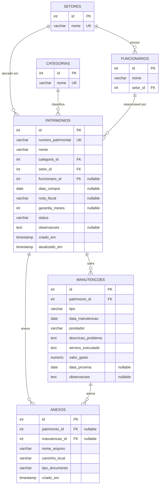

# Modelagem do Banco de Dados - Sistema de Controle Patrimonial

Este documento descreve a modelagem física do banco de dados PostgreSQL, incluindo tabelas, tipos de dados, chaves primárias/estrangeiras, índices e relacionamentos.

## Diagrama Entidade-Relacionamento (ERD)

O diagrama abaixo representa a relação lógica entre as entidades do sistema:

---

## Dicionário de Dados

### 1. Tabela `setores` (Setores de alocação)
Armazena os setores da empresa para organização e filtragem.

| Campo | Tipo | Restrições | Descrição |
| :--- | :--- | :--- | :--- |
| `id` | SERIAL (INT) | PRIMARY KEY | Identificador único do setor. |
| `nome` | VARCHAR(100) | UNIQUE, NOT NULL | Nome do setor (ex: 'TI', 'Financeiro'). |

### 2. Tabela `categorias` (Categorias dos Bens)
Classificação do tipo de patrimônio.

| Campo | Tipo | Restrições | Descrição |
| :--- | :--- | :--- | :--- |
| `id` | SERIAL (INT) | PRIMARY KEY | Identificador único da categoria. |
| `nome` | VARCHAR(100) | UNIQUE, NOT NULL | Nome da categoria (ex: 'Notebook', 'Cadeira'). |

### 3. Tabela `funcionarios` (Responsáveis pelos bens)
Colaboradores vinculados que podem responder por um patrimônio.

| Campo | Tipo | Restrições | Descrição |
| :--- | :--- | :--- | :--- |
| `id` | SERIAL (INT) | PRIMARY KEY | Identificador único do funcionário. |
| `nome` | VARCHAR(150) | NOT NULL | Nome completo do funcionário. |
| `setor_id` | INT | FOREIGN KEY, NOT NULL | Vinculado à tabela `setores(id)`. ON DELETE RESTRICT. |

### 4. Tabela `patrimonios` (Os bens cadastrados)
Entidade central do sistema.

| Campo | Tipo | Restrições | Descrição |
| :--- | :--- | :--- | :--- |
| `id` | SERIAL (INT) | PRIMARY KEY | Identificador único interno. |
| `numero_patrimonial` | VARCHAR(30) | UNIQUE, NOT NULL | Código único sequencial visível (ex: '001', '002'). Gerado por `numero_patrimonial_seq`. |
| `nome` | VARCHAR(150) | NOT NULL | Nome descritivo do patrimônio. |
| `categoria_id` | INT | FOREIGN KEY, NOT NULL | Vinculado à tabela `categorias(id)`. ON DELETE RESTRICT. |
| `setor_id` | INT | FOREIGN KEY, NOT NULL | Setor onde o bem físico se encontra. ON DELETE RESTRICT. |
| `funcionario_id` | INT | FOREIGN KEY, NULLABLE | Colaborador em posse do bem. Obrigatório se status for 'Em uso'. ON DELETE RESTRICT. |
| `data_compra` | DATE | NULLABLE | Data de aquisição do bem. |
| `nota_fiscal` | VARCHAR(100) | NULLABLE | Número/identificação da Nota Fiscal de compra. |
| `garantia_meses` | INT | NULLABLE | Tempo de garantia em meses a partir da data de compra. |
| `status` | VARCHAR(30) | NOT NULL | Estados: 'Disponível', 'Em uso', 'Em manutenção', 'Baixado'. |
| `observacoes` | TEXT | NULLABLE | Informações adicionais do patrimônio. |
| `criado_em` | TIMESTAMP | DEFAULT NOW() | Data e hora de criação do registro. |
| `atualizado_em` | TIMESTAMP | DEFAULT NOW() | Data e hora da última modificação. |

### 5. Tabela `manutencoes` (Histórico de intervenções técnicas)
Registro de todas as manutenções corretivas e preventivas.

| Campo | Tipo | Restrições | Descrição |
| :--- | :--- | :--- | :--- |
| `id` | SERIAL (INT) | PRIMARY KEY | Identificador único. |
| `patrimonio_id` | INT | FOREIGN KEY, NOT NULL | Vinculado a `patrimonios(id)`. ON DELETE CASCADE. |
| `tipo` | VARCHAR(30) | NOT NULL | 'Preventiva' ou 'Corretiva'. |
| `data_manutencao` | DATE | NOT NULL | Data em que a manutenção ocorreu. |
| `prestador` | VARCHAR(150) | NOT NULL | Empresa ou técnico responsável pelo serviço. |
| `descricao_problema` | TEXT | NOT NULL | O defeito ou motivo da parada. |
| `servico_executado` | TEXT | NOT NULL | O que foi feito para corrigir/prevenir. |
| `valor_gasto` | NUMERIC(10, 2) | NOT NULL, >= 0 | Valor financeiro gasto na manutenção. |
| `data_proxima` | DATE | NULLABLE | Data sugerida para a próxima manutenção (preventiva). |
| `observacoes` | TEXT | NULLABLE | Informações extras sobre o serviço. |

### 6. Tabela `anexos` (Documentos e arquivos)
Armazena a referência física dos arquivos vinculados a patrimônios ou manutenções.

| Campo | Tipo | Restrições | Descrição |
| :--- | :--- | :--- | :--- |
| `id` | SERIAL (INT) | PRIMARY KEY | Identificador único do anexo. |
| `patrimonio_id` | INT | FOREIGN KEY, NULLABLE | Vinculado a `patrimonios(id)`. ON DELETE CASCADE. |
| `manutencao_id` | INT | FOREIGN KEY, NULLABLE | Vinculado a `manutencoes(id)`. ON DELETE CASCADE. |
| `nome_arquivo` | VARCHAR(255) | NOT NULL | Nome original do arquivo (ex: 'nota_fiscal_laptop.pdf'). |
| `caminho_local` | VARCHAR(512) | NOT NULL | Caminho físico no servidor/disco local (pasta `assets/attachments/`). |
| `tipo_documento` | VARCHAR(50) | NOT NULL | Categorias: 'Foto', 'Nota Fiscal', 'Manual', 'Garantia', 'Outros'. |
| `criado_em` | TIMESTAMP | DEFAULT NOW() | Data de inserção do anexo. |

---

## Índices de Otimização

Para garantir pesquisas de alta performance, criaremos os seguintes índices:

1. `idx_patrimonios_numero` na coluna `patrimonios(numero_patrimonial)` - Acelera pesquisas diretas por código.
2. `idx_patrimonios_status` na coluna `patrimonios(status)` - Usado em contagens de Dashboard e listas filtradas.
3. `idx_manutencoes_patrimonio` na coluna `manutencoes(patrimonio_id)` - Acelera o carregamento do histórico na tela de detalhes.
4. `idx_anexos_patrimonio` na coluna `anexos(patrimonio_id)` - Otimiza o carregamento de anexos.
5. `idx_funcionarios_setor` na coluna `funcionarios(setor_id)` - Otimiza joins comuns para listagem.

---

## Migrações (Alembic)

Utilizaremos o **Alembic** integrado ao SQLAlchemy para gerenciar as versões e alterações de esquema do banco de dados. 
As migrações serão versionadas e executadas na inicialização ou via comando CLI de implantação.
- A primeira migration conterá a criação da sequence `numero_patrimonial_seq`, das tabelas base, chaves estrangeiras, restrições e índices.
- A sequence será configurada para iniciar em 1 e incrementar de 1 em 1, garantindo identificadores sequenciais contínuos e não reutilizáveis.
- Os dados padrões iniciais (setores e categorias sugeridos pelo usuário) serão inseridos por um script de sementes (`seed`) executado opcionalmente ou de forma automática se o banco estiver vazio.
